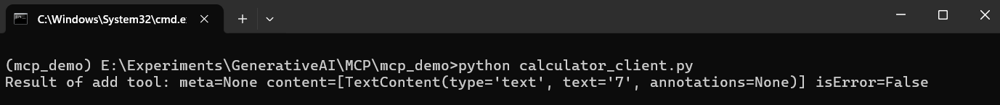

# MCP Server Experiments

This is a demonstration repository showcasing a modular client-server computation setup using Python. It simulates basic calculator functionalities and integrates with a lightweight SQLite backend to track operations or simulate stateful processing.

## 🚀 Features

- Modular Python components for client-server interaction
- SQLite-based server logic (`sqlite_server.py`)
- Arithmetic calculator module with a client (`calculator.py`, `calculator_client.py`)
- Simple interface for local testing (`main.py`)
- Sample database (`community.db`) for demonstration
- Built with Python and configured via `pyproject.toml`

## 📁 Project Structure

```

mcp\_demo/
├── calculator.py             # Core arithmetic operations
├── calculator\_client.py      # Client code to interact with calculator
├── sqlite\_server.py          # Lightweight SQLite server module
├── main.py                   # Entry point for running the demo
├── community.db              # Prebuilt SQLite DB for demo use
├── greetings.txt             # Sample data file
├── pyproject.toml            # Python project configuration
├── .gitignore
└── .python-version

````

## 🛠️ Installation

1. Clone the repository:
    ```bash
    git clone https://github.com/codemaker2015/mcp-server-experiments.git
    cd mcp-server-experiments
    ```

2. Install uv
    ```bash
    powershell -ExecutionPolicy ByPass -c "irm https://astral.sh/uv/install.ps1 | iex"
    set Path=C:\Users\Codem\.local\bin;%Path%
    ```

3. Create a virtual environment.
    ```bash
    uv venv
    source .venv/bin/activate # for linux
    .venv\Scripts\activate    # for windows
    ```
3. Install dependencies (if specified in `pyproject.toml` or requirements file):
   ```bash
   uv add -r requirements.txt
   ```

## 🧪 Usage

- Install MCP server to Claude Desktop:
    ```bash
    mcp install calculator.py
    mcp install sqlite_server.py
    ```

- Directly test client-server simulations using MCP Inspector:
    ```bash
    mcp dev sqlite_server.py
    mcp dev calculator_client.py
    ```

## 📦 Demos

- MCP First Server


- MCP SQLite Server


- MCP Stock Price Server


- MCP Stock Analysis Server


- MCP Client


